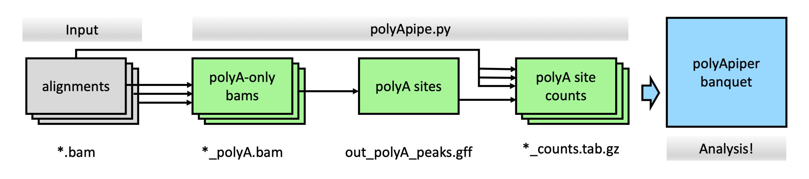

```{r setup, include=FALSE}
knitr::opts_chunk$set(echo = TRUE)
```

_NB: Document under active development!_


# Overview

 


1. **Input** :  The input to polyApipe is one or more indexed bam files. 
   + These must be soft-masked so the unaligned 'A's can be found,
   (e.g. from an aligner such as STAR [@Dobin2013]). 
   + They should also contain corrected cell barcode tags and uncorrected UMI tags. 
   (NB: Output from the cellranger pipeline typically used by 10X data is suitable)
2. **PolyA sites and counts** : Next python script polyApipe.py will prepare the
data for loading into R as follows;
   + *Find polyA-containing reads in bam files.* These will have a soft-clipped
   stretch of polyA (or polyT depending on strand) at the 3' end of the read. 
   This is done for every bam file, and written to _polyA.bam files.
   + *Look for sites where there are a large number of polyA reads.* The polyA site
   is defined 250bp (--region_size) upstream of where the unaligned As begin 
   (ie end of transcription).
   This is done across a pool of all samples' polyA reads in a stranded manner, 
   resulting in a single .gff file defining peaks.
   + *Count reads per APA site per cell.* Create a counts matrix of total reads 
   (not just polyA reads) falling in each APA site. 
   This step uses featureCounts [@Liao2014] and UMI-tools [@Smith2017] to count 
   cells per feature using the uncorrected UMI tags (and corrected cell barcodes).
   There will be one file per sample / input bam, saved as *_counts.tab.gz.
3. **Calculate APA in R. ** The polyApiper R package will prepare a 'banquet' of results for alternative polyA (APA) analysis.
4. **APA Analysis** 


<!-- Todo: put polyApipe into its own conda? -->


# Example analysis - pbmc8k 

<!-- setwd("/mnt/ceph/mbp/servers/bioinformatics-platform/home/sarah.williams/tmp_cmd_tests") -->

The 'pbmc8k' dataset contains around 8000 PBMCs (peripheral blood mononuclear cell) 
from a healthy individual. It is a publicly available dataset provided by 10X 
genomics: (https://support.10xgenomics.com/single-cell-gene-expression/datasets/2.1.0/pbmc8k)


## Get input files

First, need the aligned bam files. 
The output of the 10X 
[cellRanger](https://support.10xgenomics.com/single-cell-gene-expression/software/pipelines/latest/what-is-cell-ranger) 
pipeline will work with default parameters.


To obtain the data files for this analysis.

```{sh eval=FALSE}
# Bam file and index. NB: large file (68GB).
wget http://s3-us-west-2.amazonaws.com/10x.files/samples/cell-exp/2.1.0/pbmc8k/pbmc8k_possorted_genome_bam.bam
wget http://cf.10xgenomics.com/samples/cell-exp/2.1.0/pbmc8k/pbmc8k_possorted_genome_bam_index.bam.bai
mv pbmc8k_possorted_genome_bam_index.bam.bai pbmc8k_possorted_genome_bam.bam.bai

# Gzipped tar file with the precomputed tsne and clusters information
wget http://cf.10xgenomics.com/samples/cell-exp/2.1.0/pbmc8k/pbmc8k_analysis.tar.gz
tar -xzf pbmc8k_analysis.tar.gz
```


## Find and quantify polyA sites

This command will produces the input required for polyApiper.
It takes some time (hours) to run.
```{sh eval=FALSE}
./polyApipe.py  -i pbmc8k_possorted_genome_bam.bam -o pbmc8k -t 8
```

There is only one sample in this experiment, so specifing the bam file with -i.
And -t means that multithreaded tools will use 8 threads. 

Once finished, the following files are output:

* **pbmc8k_polyA.bam** : A bam file of all the polyA-containing reads seen in the input bam.
* **pbmc8k_polyA.bam.bai** : Bam index.
* **pbmc8k_polyA_peaks.gff** : gff file defining the polyA site regions, defined from peaks of polyA reads in the input. 
The sites are typically 250bp (*--region_size*) upstream of the polyA site (unless larger regions were merged).
The misprime status (depending on *--misprime_A_count* and *--misprime_in*) flags sites near A-rich genomic regions. 
E.g.


         1	polyAends	polyAends	16442	16691	.	-	.	peak="1_16442_r"; peakdepth="10"; misprime="False";
         1	polyAends	polyAends	184920	185169	.	-	.	peak="1_184920_r"; peakdepth="179"; misprime="False";
         1	polyAends	polyAends	632454	632703	.	+	.	peak="1_632703_f"; peakdepth="3468"; misprime="True";


* **pbmc8k_counts.tab.gz** : A gzipped tab-delimited text file of the number of reads aligned per cell in each polyA site peak.
All reads are counted, whether or not they include a polyA. 
Format _\<peakname\> \<cell\> \<number of reads\>_ .

         10_44994717_f	AACTGGTAGTACGCCC	1
         10_44994717_f	AACTGGTCAGTCCTTC	2
         10_44994717_f	AACTTTCCAGTCAGAG	1


## Calculate APA in R

```{r eval=FALSE}
library(polyApiper)

# - Get appropriate ENSEMBL annotations and DNA sequence from AnnotationHub
# - Classify genomic regions into exon,intron,3'UTR,extension
polyApiper:::do_ensembl_organism(
    out_path="human_ens100", 
    species="Homo sapiens", 
    version="100")

# - Load output from polyApipe.py
# - Produce HDF5Array SingleCellExperiment objects containing counts
# - Perform further analysis steps
polyApiper:::do_pipeline(
    out_path      ="pbmc8k_banquet", 
    counts_files  ="pbmc8k_counts.tab.gz", 
    peak_info_file="pbmc8k_polyA_peaks.gff", 
    organism      ="human_ens100",
    )


# To [re]-load for analysis.
banq <- load_banquet("pbmc8k_banquet")
```

Now the _pbmc8k_banquet_ directory has been setup - with APA information ready for 
downstream analysis. 


# Details


## Processing multiple samples

If a given experiment has multiple samples in separate bam files, these can be put in a directory 
and processed together. Just proveide the directory to the -i paramter of polyApipe.py. 

```
./polyApipe.py  -i multi_bam_experiment_dir -o this_experiment_polyA -t 8
```

When multiple files are processed, the output will be a directory, with individual *_polyA.bam
and *counts.tab.gz files for each sample. There will still be a single output_polyA_peaks.gff
file, made considering all polyA reads from all samples pooled together. 
All samples are counted against this same set of regions.

These can then be loaded together into into R with polyApipeR.


## Processing large datasets

When processing multiple files at the polyApipe.py step, individual samples are
processed one at a time. 
The -t / --threads option is simply passed through to tools that support multithreading. 
This is probably sufficent for most experiments. 


However, it might not be ideal for very large experiments (e.g. 100+ samples).
In those cases, its possible to use snakemake to run parts of the pipeline in 
parallel on a cluster.
Refer to snakemake docs for how to set this up, 
but there is a template to show the processing logic on github [here](https://github.com/swbioinf/polyApipe/tree/master/data/snakemake_template). 
This _will_ need to be adjusted to suit your local compute.

```{sh eval=FALSE}
# Add snakemake and graphviz into your conda env.
conda activate polyApipe_snakemake  
snakemake --jobs 30 --cores 8 --cluster-config cluster.json --cluster "sbatch -A {cluster.account} -c {cluster.c}  -t {cluster.time}"
```


## Parameters of polyApipe.py 

Running `polyApipe.py --help` shows many options - described below. Most are rarely needed. 


--------------------

**Main options** : Input and output. Essential. _--output_ should not exist.

```
Main:
  -i INPUT [INPUT ...], --input INPUT [INPUT ...]
                        A bam file, bam files, or single directory of bam
                        files. (default: None)
  -o OUT_ROOT, --output OUT_ROOT
                        Name root to use for output files. (default: None)
```


--------------

**PolyA peak options** : For changing how the polyA sites are defined. 
Increase _--depth_threshold_ for large datasets.

```
PolyA peak options:
  Set peak-level configs

  --depth_threshold DEPTH_THRESHOLD
                        Need at least this many reads in a peak to call an APA
                        site. (default: 1)
  --region_size REGION_SIZE
                        Size upstream of APA site to consider polyA reads.
                        (default: 250)
```


-------

**PolyA read options** : For changing what reads are considered polyA reads. 
Defaults should usually be sufficient.

```
PolyA read options:
  Set read-level configs for defining polyA reads

  --minMAPQ MINMAPQ     Minimum MAPQ mapping quality to consider. (default:
                        10)
  --minpolyA MINPOLYA   Number of A to consider polyA. (default: 5)
  --non_A_allowed NONA_ALLOWED
                        Number of non A bases permitted in polyA region (while
                        still having --minpolyA As) (default: 0)
  --misprime_A_count MISPRIME_A_COUNT
                        Number of As seen in the last --misprime_in of aligned
                        reads to label potential mispriming (default: 8)
  --misprime_in MISPRIME_IN
                        Look for --misprime_A_count As in this many
                        nucleotides at the end of a reaad alignment when
                        labelling potential misprime (default: 10)
```

-------

**Bam Tag options** : Not needed for typical 10X pipeline output, but if 
something other than the CB and UR tags are used for describing barcodes, 
specify here.

```
Bam tags:
  For specifiing umi, cell e.t.c

  --cell_barcode_tag CORRECTED_CELL_BARCODE_TAG
                        Corrected (exact-match) cell barcode bam tag used in
                        bam input. (default: CB)
  --umi_tag UMI_TAG     Uncorrected UMI / molecular barcode bam tag used in
                        bam input. May contain mismatches. (default: UR)
```


----------

**Running options** : The _-t/--threads_ option should usually be used to
tell multithreaded tasks how many threads they can use. 
The rest of these options are just for running via snakemake or debugging.


```
Running:
  For changing how this script runs. Stop/start on polyA step e.t.c

  -t THREADS, --threads THREADS
                        Num threads for multithreaded steps. (default: 1)
  --no_peaks            Stop after making polyA bams. Do not try to find peaks
                        in polyA files (implies --no_anno --no_count)
                        (default: False)
  --no_count            Stop after making merged polyA peaks gff file. Do not
                        try to count them, or annotate bams with them.
                        (default: False)
  --polyA_bams          Skip polyA filtering step, the bams specified with
                        '-i' are already filtered to polyA-containing reads
                        only. (default: False)
  --peaks_gff PEAKS_GFF
                        If provided, use this gff file of peaks instead of
                        making one from polyA reads. Skips polyA filtering
                        steps, incompatable with --polyA_bams This is a gtf
                        format specifically as output by this script. See
                        example data. (default: None)
  --keep_interim_files  Don't delete the intermediate files (merged polyA,
                        annotated input bams).For debugging or piecemeal runs.
                        (default: False)
                        
```                        
                        


# References